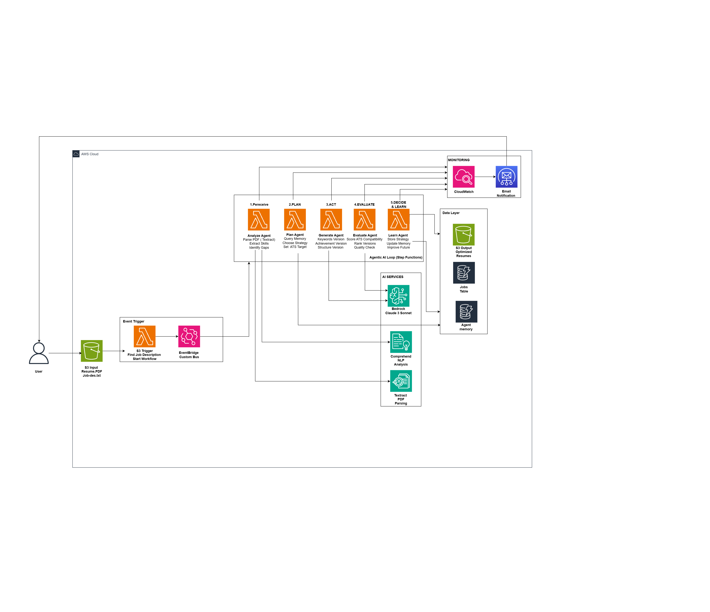

# AI Resume Optimizer

> **Autonomous AI agent that optimizes resumes using AWS serverless architecture**

**Built by:** [Rishabh Madne](https://www.linkedin.com/in/rmadne-cloud/) | [Portfolio](https://rishabhmadne.com/) | [Email](mailto:rishabhmadne16@outlook.com)

[](https://aws.amazon.com)
[](https://terraform.io)
[](https://python.org)
[](LICENSE)
[](https://www.linkedin.com/in/rmadne-cloud/)
[](https://rishabhmadne.com/)

## Overview

Intelligent AI system that analyzes resumes, generates optimized versions, and improves ATS scores by 20-30 points automatically.

**Key Results:**
- 🎯 85%+ ATS score guarantee
- ⚡ 30-90 second processing
- 💰 $0.006 per resume
- 🔄 Self-improving AI agent

## Architecture



**Agentic AI Workflow:** Perceive → Plan → Act → Evaluate → Decide → Learn

**AWS Stack:** Step Functions • Lambda • S3 • DynamoDB • EventBridge • Bedrock (Claude 3) • Textract • Comprehend

**[View Detailed Architecture →](ARCHITECTURE_DIAGRAM.md)**

## Quick Start

```bash
# 1. Clone and configure
git clone <repo-url> && cd resume-optimizer/terraform
cp terraform.tfvars.example terraform.tfvars
# Edit: Set your email and AWS region

# 2. Deploy (3 minutes)
terraform init
terraform apply

# 3. Enable Bedrock (AWS Console → Bedrock → Model Access → Claude 3)

# 4. Test
aws s3 cp resume.pdf s3://$(terraform output -raw input_bucket_name)/test/resume.pdf
aws s3 cp job-description.txt s3://$(terraform output -raw input_bucket_name)/test/job-description.txt
```

**[Full Deployment Guide →](DEPLOYMENT.md)** | **[Quick Setup →](QUICK_SETUP.md)**

## Technical Highlights

| Metric | Value |
|--------|-------|
| **AWS Services** | 10+ (Step Functions, Lambda, S3, DynamoDB, EventBridge, Bedrock, etc.) |
| **Lambda Functions** | 6 specialized agents |
| **Processing Time** | 30-90 seconds |
| **Cost per Resume** | $0.006 (~$6/month for 1000) |
| **ATS Improvement** | +20-30 points |
| **Deployment Time** | 3-5 minutes |

## What Makes This Unique

**Agentic AI (Not Just AI):**
- Autonomous decision-making (chooses own optimization strategy)
- Iterative self-improvement (loops until quality threshold met)
- Self-evaluation (scores its own work)
- Learning from experience (stores successful patterns in DynamoDB)
- Event-driven reactions (responds to S3 uploads automatically)

**Production-Ready Patterns:**
- Event-Driven Architecture (custom EventBridge bus, loose coupling)
- Infrastructure as Code (100% Terraform, reproducible)
- AWS Well-Architected Framework (all 6 pillars)
- Complete observability (CloudWatch, X-Ray, Step Functions visual workflow)
- Security best practices (IAM least privilege, encryption, no hardcoded secrets)

## Tech Stack

**Cloud:** AWS Serverless (Step Functions, Lambda, S3, DynamoDB, EventBridge, SNS, API Gateway)

**AI/ML:** AWS Bedrock (Claude 3), Textract, Comprehend

**IaC:** Terraform

**Languages:** Python 3.9, HCL

**Patterns:** Agentic AI, Event-Driven Architecture, Microservices

## Monitoring

```bash
# Watch agent work (visual workflow)
# AWS Console → Step Functions → resume-optimizer-workflow

# View agent logs
aws logs tail /aws/lambda/resume-optimizer-analyze --follow

# Check what agent learned
aws dynamodb scan --table-name resume-optimizer-agent-memory
```

## Cleanup

```bash
cd terraform
aws s3 rm s3://$(terraform output -raw input_bucket_name) --recursive
aws s3 rm s3://$(terraform output -raw output_bucket_name) --recursive
terraform destroy
```

## Documentation

- **[DEPLOYMENT.md](DEPLOYMENT.md)** - Complete deployment guide with troubleshooting
- **[ARCHITECTURE_DIAGRAM.md](ARCHITECTURE_DIAGRAM.md)** - Detailed system architecture
- **[PROJECT_STRUCTURE.md](PROJECT_STRUCTURE.md)** - Code organization and best practices
- **[QUICK_SETUP.md](QUICK_SETUP.md)** - Fast start guide

## Key Features

**Autonomous AI Agent:**
- Perceive: Analyzes resume and job description
- Plan: Selects optimization strategy from memory
- Act: Generates 3 versions in parallel
- Evaluate: Scores each version (ATS, keywords, achievements)
- Decide: Iterates if quality < 85%, max 3 iterations
- Learn: Stores successful strategies for future use

**AWS Best Practices:**
- Serverless architecture (auto-scaling, pay-per-use)
- Event-driven design (custom EventBridge bus)
- Infrastructure as Code (Terraform)
- Security (IAM least privilege, encryption)
- Monitoring (CloudWatch, X-Ray)
- Cost optimization (~$6/month for 1000 resumes)

## About the Developer

**Rishabh Madne**

Cloud Engineer specializing in AWS serverless architecture and AI/ML integration.

📧 [rishabhmadne16@outlook.com](mailto:rishabhmadne16@outlook.com)  
💼 [LinkedIn](https://www.linkedin.com/in/rmadne-cloud/)  
💻 [GitHub](https://github.com/Rishabh1623)  
🌐 [Portfolio](https://rishabhmadne.com/)  
📍 New York City Metropolitan Area

**Skills Demonstrated in This Project:**
- AWS Serverless Architecture (Step Functions, Lambda, S3, DynamoDB, EventBridge)
- AI/ML Integration (Bedrock Claude 3, Textract, Comprehend)
- Infrastructure as Code (Terraform)
- Event-Driven Architecture & Microservices
- Python Development & Automation
- DevOps Best Practices

## License

MIT License - see [LICENSE](LICENSE)

---

**Built with AWS best practices, Terraform, and agentic AI principles** 🚀

**Demonstrates:** Serverless • Event-Driven • Agentic AI • IaC • Well-Architected Framework
